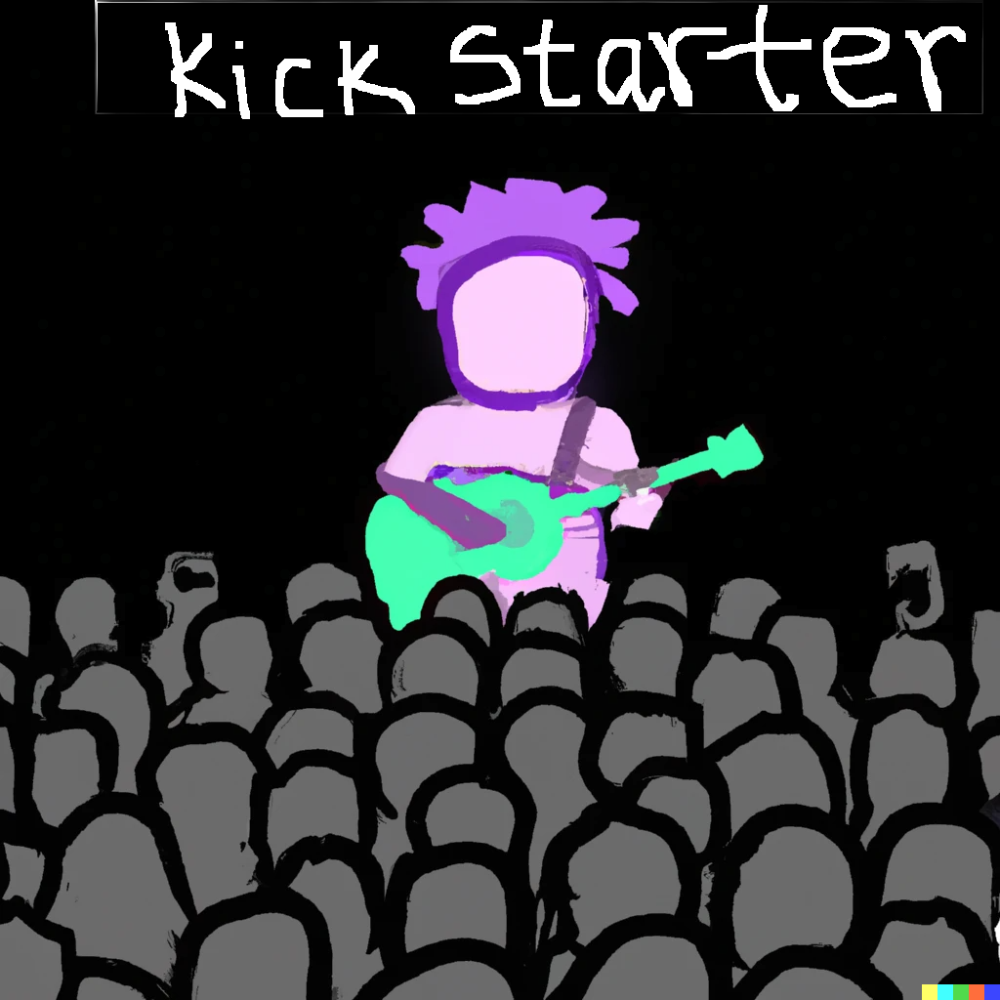

# Kickstarter a crowdfunding platform

### Ram Gollakota

## Overview and Origin

* Kickstarter (https://www.kickstarter.com/) is a crowdfunding platform that allows individuals or groups to collect funds for creative projects by soliciting modest sums of money from a large number of people, generally over the internet. It is a for-profit firm formed in 2009 that serves as a global crowdfunding platform for creative initiatives in fields such as art, music, cinema, technology, and others. Kickstarter has enabled creators to present their ideas to the public and obtain funding from supporters who support their work, resulting in the completion of thousands of projects.

 

* When was the company incorporated?
  2009

* Who are the founders of the company?

  Kickstarter was founded in 2009 by Perry Chen, Yancey Strickler, and Charles Adler. The company is headquartered in Brooklyn, New York.

  Perry Chen is a New Orleans-born artist, musician, and entrepreneur who co-founded Kickstarter in 2009. He serves as the company's CEO.

  Yancey Strickler is a writer and entrepreneur who co-founded Kickstarter in 2009. He serves as the company's Chief Strategy Officer.

  Charles Adler is a designer and entrepreneur who co-founded Kickstarter in 2009. He served as the company's Chief Design Officer until leaving the company in 2013.

* How did the idea for the company (or project) come about?

The idea for Kickstarter originated from co-founder Perry Chen's experience as a musician and event organizer. Chen planned a concert in New Orleans in 2002 but struggled to get funding. He eventually took out a loan and used credit cards to pay for the concert, but the experience left him frustrated and motivated to discover a better method to support creative initiatives.

Chen developed the concept in 2005 to build a platform that would allow people to financially support creative projects before they were done. He discussed the idea with his friend Yancey Strickler, and together they proceeded to build the Kickstarter concept. They launched the Kickstarter website in 2009, with the assistance of designer Charles Adler, and the rest is history.

* How is the company funded? How much funding have they received?

Kickstarter was founded as a way to democratize the process of bringing creative projects to life. The founders believed that anyone with a good idea should have the opportunity to bring it to fruition, regardless of their financial resources or connections. Since its founding, Kickstarter has helped thousands of projects come to fruition and has become a well-known and trusted platform for crowdfunding creative projects.

Kickstarter is a for-profit company that earns money by charging a percentage charge on successful campaigns. When a Kickstarter project reaches its funding target, the company takes a 5% cut of the funds raised. If the project fails to meet its financing objective, no funds are collected and no fee is levied. In addition to this cost, successful campaigns are subject to a payment processing fee of roughly 3-5%.

Kickstarter's funding amount is not publicly available because the company is privately held and has not revealed this information. It is important to note, however, that Kickstarter is not supported by typical venture capital. Instead, the corporation makes money by charging fees for successful advertising. Kickstarter can remain autonomous and focused on its purpose of promoting creative projects and communities thanks to this arrangement. However, it is worth mentioning that since its start in 2009, Kickstarter had received $6.6 billion in pledges from 21 million contributors as of July 2021, funding 222,000 projects such as films, music, stage plays, comics, journalism, video games, board games, technology, publishing, and food-related ventures. Everette Taylor the current CEO of Kickstarter from September 2022 indicated in an interview with Bloomberg in October 2022, that it had been profitable since year 2.

## Business Activities:

* What specific financial problem is the company or project trying to solve?

Kickstarter is a crowdfunding platform that tries to tackle the problem of creative project financial access. Many creative projects, particularly those in the arts and media, require significant upfront funding. However, traditional forms of financing, such as loans or investments, are often difficult to secure for these projects. As a result of a lack of money, many creative ideas go unrealized or are considerably delayed.

Kickstarter seeks to address this issue by offering a venue for creators to present their ideas to the public and earn small sums of financing from a large number of backers. This enables artists to raise the funds required to bring their projects to fruition without relying on traditional means of financing. In this sense, Kickstarter serves to democratize the process of bringing creative ideas to life, giving anybody with a good idea a chance to make it a reality.

* Who is the company's intended customer?  Is there any information about the market size of this set of customers?

Kickstarter's intended customers are creators looking for money for creative projects in a range of areas such as art, music, cinema, technology, and more. These creators can be individuals, groups, or organizations based anywhere in the world.

As a result, Kickstarter's target demographic is fairly broad, and it includes anyone with a creative concept that they want to bring to reality. The company does not provide particular market size figures because it is difficult to determine the number of potential creators who may seek funding through the platform. 

* What solution does this company offer that their competitors do not or cannot offer? (What is the unfair advantage they utilize?)

Kickstarter's success as a crowdsourcing platform is due to a few key factors:

Kickstarter has a large network of backers that support creative projects on the platform. This community is engaged and passionate about fostering creativity, and it contributes to the platform's sense of excitement and energy.

1. Trust: Kickstarter has established itself as a trustworthy and dependable crowdfunding platform for creative projects. The company has tight criteria for what types of projects are permitted on the platform, as well as systems in place to guarantee that projects are properly vetted and funds are used wisely.
2. Simplicity: The Kickstarter platform is intended to be simple to use for both creators seeking financing and backers supporting projects. The website is simple and easy to use, making the crowdfunding process accessible to a wide spectrum of consumers.
3. Visibility: Because Kickstarter has a huge and active user base, projects on the platform receive a lot of attention. This, in turn, raises the likelihood of a project being funded successfully.

These elements have contributed to Kickstarter's position as a leading platform for crowdfunding creative projects, making it difficult for competitors to replicate its success.

* Which technologies are they currently using, and how are they implementing them? 

Kickstarter operates its platform and supports its operations using a range of technologies. Kickstarter's platform is designed using a combination of web technologies such as HTML, CSS, and JavaScript. These technologies are utilized to develop the platform's user interface and functionality.

1. 
   Server-side technologies: Kickstarter's platform is driven by a range of server-side technologies, including Linux-based servers and programming languages such as Python and Ruby. These technologies are used to manage the platform's back-end functions, such as data storage, processing, and security.

2. Payment processing technologies: To support transactions on the platform, Kickstarter employs payment processing technology. Stripe and PayPal are two examples of technology that handle the secure processing of payments from backers to creators.

3. Data analytics technologies: Kickstarter tracks and analyzes data about the platform and its users using data analytics technology. This allows the organization to better understand how the platform is being utilized and make more educated business decisions.

## Landscape:

* What domain of the financial industry is the company in?

Kickstarter is a financial industry-focused crowdfunding platform. Kickstarter, in particular, is a component of the alternative finance business, which refers to non-conventional financing methods that operate outside of the regular banking system.

Crowdfunding platforms such as Kickstarter enable creators to support creative projects by raising small sums of money from a large number of backers. This is an alternative to traditional kinds of financing, such as loans or investments, which can be difficult to obtain for creative ventures.

Since its inception in 2009, Kickstarter has helped to democratize the process of bringing creative ideas to life, allowing anybody with a decent idea to have a chance to see it through. The company has also helped to raise awareness of the possibility of alternative finance techniques, as well as the ability of the audience to support and fund creative enterprises.

* What have been the major trends and innovations of this domain over the last 5-10 years?

In the previous five years, there have been several notable trends in crowdfunding. Among the most prominent trends are:

1. Increased usage of crowdfunding for social impact projects: There has been an increase in the use of crowdfunding platforms to support initiatives with a social or environmental purpose in recent years. This covers programs addressing topics including climate change, homelessness, and education.

2. Equity crowdfunding has increased in popularity in recent years. Equity crowdfunding involves the sale of ownership stakes in a company to investors. This movement has been fueled in part by new rules, such as the Jumpstart Our Business Startups (JOBS) Act in the United States, which made it simpler for businesses to seek financing through crowdsourcing.

3. Reward-based crowdfunding is becoming increasingly popular as a means for creators to fund creative projects. Backers receive a reward in exchange for their support. The success of sites like Kickstarter, which pioneered the use of prizes to attract backers, has fueled this trend.

4. Increased use of crowdfunding by established companies: In recent years, there has been an increase in the use of crowdfunding platforms by established companies to raise funds and test market demand for new goods. This has featured companies from a wide range of industries, including technology, retail, and consumer products.

* What are the other major companies in this domain?
There are several crowdfunding platforms available today, each with its own distinct purpose and economic approach. Among the largest crowdsourcing companies are:

1. Indiegogo is a crowdfunding platform that allows producers to raise funds for a variety of initiatives such as creative enterprises, humanitarian causes, and business ventures. Since its inception in 2008, the company has helped fund over 800,000 projects.

2. GoFundMe is a crowdfunding website that focuses on personal causes and charitable donations. Since its inception in 2010, the company has raised over $10 billion for personal causes and organizations.

3. Crowdfunder: Crowdfunder is an equity crowdfunding platform that allows businesses to raise funds by selling ownership holdings to backers. Since its inception in 2011, the company has assisted in the funding of over 1,000 projects.

4. Patreon is a subscription-based crowdfunding platform where creators can get continuing support from their fans. Since its inception in 2013, the company has assisted creators in earning oveIn terms of overall market share, Kickstarter is one of the largest crowdfunding platforms and has a strong presence in a variety of categories such as art, music, film, and technology. The company has a large and active user base and has established itself as a trusted and reliable platform for crowdfunding creative projects.

## Results

* What has been the business impact of this company so far?

Kickstart has had a significant impact on alternative funding methods, demonstrating the ability of the crowd to support and fund creative initiatives. As a result, the company has had a significant impact on how creative initiatives are funded and has helped to build the alternative finance industry.

Kickstarter has had a major economic impact in addition to its impact on the creative industry. To far, the platform has assisted in the funding of over 200,000 successful initiatives, many of which have gone on to produce money, create jobs, and contribute to local economies.

* What are some of the core metrics that companies in this domain use to measure success? How is your company performing, based on these metrics?

1. Crowdfunding organizations generally measure success using a variety of measures. These metrics can vary depending on the company's specific emphasis and business model, however some common metrics used by crowdfunding companies include:

2. Funding raised: A significant measure for crowdfunding companies is the total amount of funding raised through the platform. This indicator shows the platform's success in facilitating transactions between creators and backers and is frequently used as a gauge of the company's overall health.

3. Number of campaigns: Another key measure for crowdfunding companies is the number of campaigns that have been started on the site. This statistic represents the platform's user base's activity and engagement and can be a useful indicator of the company's growth and reach.

4. Success rate: Another important indicator for crowdfunding companies is the success rate of projects on the platform, or the percentage of campaigns that reach their financing targets. This indicator represents the platform's performance in assisting successful campaigns and can be a key component in recruiting artists and backers.

5. Average campaign size: Another indicator that crowdfunding companies frequently utilize is the average size of campaigns on the platform, or the average amount of funds raised each campaign. This metric can help the organization better understand its user base by providing insight into the types of projects that are most successful on the platform.

6. User engagement: Another measure that crowdfunding firms frequently employ is the amount of engagement of the site's users, such as the number of supporters supporting projects and the frequency with which they engage with the platform. This indicator represents the platform's community strength and can be an essential component in its success.

* How is your company performing relative to competitors in the same domain?

Kickstarter is one of the top crowdfunding sites in terms of overall market share, and it has a strong presence in a range of areas such as art, music, cinema, and technology. The company has a huge and active user base and has established itself as a trustworthy and dependable platform for creative project crowdfunding.

## Recommendations

* If you were to advise the company, what products or services would you suggest they offer? 

Kickstarter may want to consider based on current market trends:

1. Metaverse: Kickstarter can take entertainment to the  Metaverse by funding new engagements in Augmented Reality/Virtual Reality space. This is currently a untapped horizon with great potential. In fact Kickstarter project Occulus was acquired by Facebook/Meta and major part of their Meta offering.

2. Alternative financing options: As the crowdfunding industry continues to evolve, there may be opportunities for Kickstarter to explore alternative financing options, such as equity crowdfunding or revenue-based financing.

3. Social impact projects: There has been a trend in recent years towards using crowdfunding platforms to support projects with a social or environmental focus. Kickstarter may want to consider ways to better support and promote these types of projects on its platform.

4. Immigrant Segment: Studies have shown that immigrant artists find it harder to secure financing, Kickstarter can have dedicated learning circles to market and attract this segment.

5. Diversification: Kickstarter may want to consider diversifying its product offering by expanding into new categories or offering additional services to creators and backers. 

6. Community based: Kickstarter can form alliances with community organizations in both urban and rural settings and help foster new business ideas and take them to market.

   

* Why do you think that offering this product or service would benefit the company?

Targeted segments: Kickstarter can excel by focusing on products or services that "feel good," such as non-GMO food, avoiding "deep-fakes" in art, and requiring non-prison manufacturing, among other things

* What technologies would this additional product or service utilize?

  Kickstarter could potentially use artificial intelligence (AI) and cloud technologies in a number of ways to improve and enhance its platform and operations. Here are a few examples of how these technologies could be used:

  1. Personalization: AI could be used to improve the personalization of the Kickstarter platform for users. For example, AI could be used to recommend projects to backers based on their interests and past activity on the platform.
  2. Fraud detection: AI could be used to improve the detection and prevention of fraud on the Kickstarter platform. For example, AI algorithms could be used to analyze patterns of behavior and identify suspicious activity.
  3. Data analysis: Cloud technologies could be used to store and analyze large amounts of data about the platform and its users. This data could be used to gain insights into user behavior and preferences, which could be used to improve the platform and better serve creators and backers.
  4. Scalability: Cloud technologies could be used to help Kickstarter scale its operations and support a larger user base. For example, cloud infrastructure could be used to handle the processing and storage of large amounts of data and to support the platform's online presence.

* Why are these technologies appropriate for your solution?

AI, cloud computing, and data analysis can help a crowdfunding business in streamlining operations, scaling successfully, and making more informed decisions, all of which can contribute to its growth and success.
